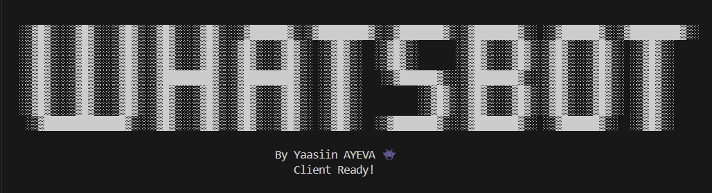

<div align="center">
    <h1>
        WhatsBot 
        <a href="https://yaasiin-dev.vercel.app/" target="_blank">
            
        </a>
    </h1>
    
    <p>
        Simple WhatsApp bot from unofficial Whatsapp API, built in NodeJS   &amp;  TypeScript, uses Gemini   &amp;   ChatGPT APIs for Completion.
    </p>
</div>

### Getting Started

Installing dependencies

```bash
npm install
```

Setup your environment variables

```bash
cp .env.example .env
```

Make sure the environment variables are set and start the server

```bash
npm run dev
```

A QR code will be generated in the terminal for you to scan.
Kindly scan it with your whatsapp app and you're all set! 🎉

### Features

1. AI Completion with Gemini AI
```
/chat [text] - Send a message to the AI
```

2. AI Completion with ChatGPT
```
/gpt [text] - Send a message to the AI
```

3. Language Translation
```
/translate [language-code] [text] - Translate text to the specified language
```

To see available language codes, use `/langlist`

4. Memes
```
/meme - Get a random meme
```

5. Jokes
```
/joke - Get a random joke
```

6. Help
```
/help - Get help
```

7. Ping
```
/ping - Ping the bot
```

### Project Structure
````	
src/
│
├── commands/         # Contains command modules
│   ├── chat.command.ts
│   ├── gpt.command.ts
│   ├── help.command.ts
│   ├── index.ts
│   ├── langlist.command.ts
│   ├── meme.command.ts
│   ├── joke.command.ts
│   ├── ping.command.ts
│   └── translate.command.ts
│
├── configs/          # Configuration files
│   ├── client.config.ts
│   ├── env.config.ts
│   └── logger.config.ts
│
├── utils/            # Utility functions
│   ├── chat-gpt.util.ts
│   ├── gemini.util.ts
│   └── translate.util.ts
│
├── public/           # Public assets
│   └── index.png     # Bot preview image
│
└── index.ts          # Main entry point
````

## License

[MIT](LICENSE)
