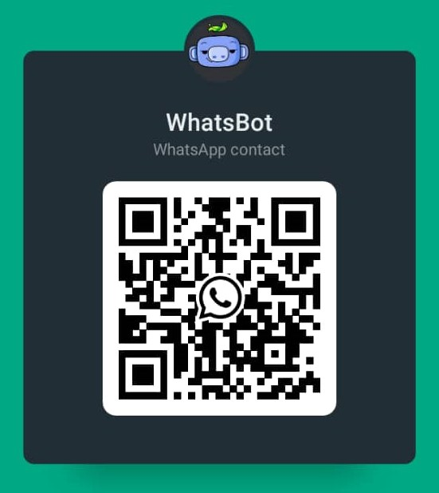

<body>
    <div align="center">
        <h1>
            WhatsBot <br/>
            
            
            
        </h1>
        
        <p>
            Simple WhatsApp bot from unofficial WhatsApp API, built in NodeJS &amp; TypeScript, using Gemini &amp; ChatGPT APIs for completion, with many cool features. You can interact with the bot using voice messages, and it will transcribe and respond. 🤖
        </p>
        <p>
            Try it here: <a href="https://wa.me/qr/SBHRATABRAZVA1" target="_blank">WhatsBot Playground</a> or scan the QR code below:
        </p>
        <br>
        
    </div>
</body>


## Features

In development mode, your bot prefix will be automatically set to `!`. Meanning that you can use `!help` to get the list of commands instead of `/help`.

| Feature | Description | Example |
| --- | --- | --- |
| Voice Chat | Chat with AI and expect a audio/text response from the bot | Just send an audio message |
| AI Completion with Gemini AI | Sends a message to the AI | `/chat [text]` |
| AI Completion with ChatGPT | Sends a message to the AI | `/gpt [text]` |
| Video Download from social media | Download file from social media | Just send the video link or `/get <url>` |
| Memes | Get random meme | `/meme` |
| Jokes | Get random joke | `/joke` |
| Help | Get help | `/help` |
| Ping | Ping the bot | `/ping` |
| Language Translation | Translate text to the specified language | `/translate [language-code] [text]` |
| Weather | Get current weather for a city | `/meteo <city>` |


## Getting Started

### I. Running on Docker (Recommended)


1. From DockerHub image for a Quick Test
```bash	
docker pull yaasiinayeva/whatsbot:latest
docker run -d -p 3000:3000 yaasiinayeva/whatsbot
```

2. From the Github Code
- After cloning the project make sure to setup your environnment variables from the `.env.example` file
```bash
cp .env.example .env
```

- Then Build your container and start your project
```bash	
docker-compose up --build -d
```

A QR code will be generated for you to scan.
Go to <a target="_blank" href="localhost:3000">localhost:3000</a>
Kindly scan it with your whatsapp app and you're all set! 🎉 


### II. Runninng Locally without docker (Not Recommended)

> [!IMPORTANT]
> Running locally requires you to do more configuration. This project is based on `whatsappweb.js` which uses `Pupperteer`. It requires a brower driver to work. You have to install Chrome or Chromium on your machine. Make sure the environment variables are set in the `.env` file before starting the server. The `PUPPETEER_EXECUTABLE_PATH` should be set to your chrome/chromium browser path.

```bash
npm install
cp .env.example .env
npm run dev
```

A QR code will be generated for you to scan.
Go to <a target="_blank" href="localhost:3000">localhost:3000</a>
Kindly scan it with your whatsapp app and you're all set! 🎉 


## Configurations

You can change the configurations in `src/configs/app.config.ts`

For third-party services used in the bot, kindly get the API keys and set them correctly. These are the one used in the bot, skipping them could lead to limitations :

- [Gemini](https://aistudio.google.com/app/apikey) : AI for text completion
- [ChatGPT](https://platform.openai.com/api-keys) : ChatGPT for text completion
- [Open Weather API](https://www.weatherapi.com/my/) : Provides weather information
- [Speechify](https://console.sws.speechify.com/api-keys) : Text-to-Speech tool used in this project
- [AssemblyAI](https://www.assemblyai.com/docs) : Speech to text tool used in this project 

## Disclaimer
> [!WARNING]
> **It is not guaranteed you will not be blocked by using this method. WhatsApp does not allow bots or unofficial clients on their platform, especially when it is used to spam people. So this shouldn't be considered totally safe.**

## TODO
- [ ] (WIP) Refactor the code to not use `btch-downloader` anymore and build a custom downloader to make it compatible with `axios` rather than `got`. Kindly check [dl-mate](https://github.com/yaasiin-ayeva/dl-mate)
- [ ] Implement a queue system to handle multiple concurrent video download requests at the same time and make the bot more responsive
- [ ] Refactor the code to not use third-party services for speech-to-text and use `whisper-node` instead
- [ ] Add support for more social media platforms
- [ ] Add support for any kind of file download
- [ ] i18n support
- [ ] Add support for more translation languages
- [ ] Implement an API for the bot
- [ ] Add more features (Open to suggestions)

## Contributing

If you'd like to contribute, please read the [Contributing Guide](CONTRIBUTING.md)

## License

[MIT](LICENSE)
