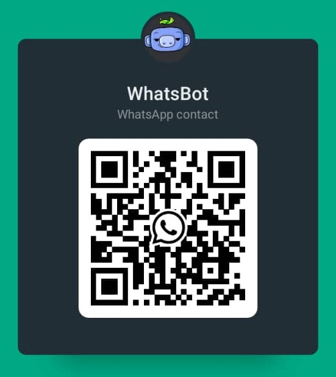

<body>
    <div align="center">
        <h1>
            WhatsBot 🤖<br/>
            
            
            
            
        </h1>
        
        <p>
            <strong>A simple WhatsApp bot with AI, social media downloads, CRM, and multilingual support</strong><br>
            Built with NodeJS & TypeScript, powered by Gemini, OpenAI GPT, Claude, and local sherpa-onnx speech
        </p>
        <p>
            🎯 Try it live: <a href="https://wa.me/qr/SBHRATABRAZVA1" target="_blank">WhatsBot Playground</a> or scan the QR code below:
        </p>
        <br>
        
    </div>
</body>

---

## Features

- **AI chat**: Gemini (`/chat`), OpenAI GPT (`/gpt`), Claude (`/claude`)
- **Voice chat**: local `sherpa-onnx` STT/TTS with admin-selectable reply model
- **Downloads**: social media video download via direct URL or `/get` (up to 150 MB)
- **Utilities**: translation, weather, memes, jokes, onboarding, ping, help
- **Group Recap**: `/recap [period]` summarises a group's activity for a time window (1h–1w); admin panel version is fully private (browser-only, nothing sent on WhatsApp)
- **Backoffice** at `/admin`: full CRM with 15 tabs — see [Admin Panel Features](#admin-panel-features) below

---

## Commands Reference

> **Note**: In development mode, use `!` prefix instead of `/` (e.g., `!help` instead of `/help`)

| Command | Description | Example |
|---------|-------------|---------|
| `/help` | Display all available commands | `/help` |
| `/ping` | Check bot responsiveness and latency | `/ping` |
| `/onboard` | Get tutorial video | `/onboard` |
| `/chat <message>` | Chat with Gemini AI | `/chat Tell me a story` |
| `/gpt <message>` | Chat with ChatGPT | `/gpt Explain quantum physics` |
| `/claude <message>` | Chat with Claude | `/claude Summarize this article` |
| **Voice Messages** | Send audio for AI voice chat (provider set in admin settings) | Just send a voice message |
| `/get <url>` | Download social media video | `/get https://tiktok.com/...` |
| **Direct URL** | Just paste the URL | `https://instagram.com/...` |
| `/translate <lang> <text>` | Translate to any language | `/translate es Hello world` |
| `/langlist` | View available languages | `/langlist` |
| `/meteo <city>` | Get current weather | `/meteo Paris` |
| `/meme` | Get random meme | `/meme` |
| `/joke` | Get random joke | `/joke` |
| `/recap [period]` | AI summary of group chat activity (group chats only). Period: `1h`, `6h`, `24h`, `2d`, `7d`, `1w`. Defaults to 24 h. Uses the AI provider configured in admin Settings. | `/recap 6h` |

---

## Quick Start

### Option 1: Docker (Recommended)

#### Quick Test with DockerHub
```bash
docker pull yaasiinayeva/whatsbot:latest
docker run -d -p 3000:3000 yaasiinayeva/whatsbot
```

#### From Source with Docker Compose
```bash
git clone https://github.com/yaasiin-ayeva/WhatsBot.git
cd WhatsBot
cp .env.example .env
# Edit .env with your core runtime settings (see Configuration section)

docker-compose up --build -d

# Access at http://localhost:3000
```

**Scan the QR code** on the web interface and you're ready!

---

### Option 2: PM2 Production Deployment

Perfect for VPS/server deployments with auto-restart and monitoring.

> **Important**: Requires Chrome/Chromium browser installed locally


```bash
git clone https://github.com/yaasiin-ayeva/WhatsBot.git
cd WhatsBot
npm install
cp .env.example .env
# Edit .env with your core runtime settings

npm install pm2 -g

# Build and start
npm run pm2:start

# Access at http://localhost:3000
```

---

### Option 3: Local Development

> **Important**: Requires Chrome/Chromium browser installed locally

```bash
npm install
cp .env.example .env
# Edit .env - MUST set PUPPETEER_EXECUTABLE_PATH to your Chrome binary

npm run dev

# Access at http://localhost:3000
```

**Chrome/Chromium Paths**:
- **macOS**: `/Applications/Google Chrome.app/Contents/MacOS/Google Chrome`
- **Linux**: `/usr/bin/chromium` or `/usr/bin/google-chrome`
- **Windows**: `C:\Program Files\Google\Chrome\Application\chrome.exe`

---

## Configuration

### Core Environment Variables

Create a `.env` file from the template:
```bash
cp .env.example .env
```

#### Essential Settings
```bash
# Environment
ENV=production                      # or development (changes command prefix)
PORT=3000

# Browser (Required for local deployment)
PUPPETEER_EXECUTABLE_PATH=/usr/bin/chromium

# Security — encrypt API keys stored in the database (strongly recommended)
# Generate with: openssl rand -hex 32
ENCRYPTION_MASTER_KEY=<64-char-hex-string>
```

> **Security note**: When `ENCRYPTION_MASTER_KEY` is set, all API keys saved via the admin panel are encrypted at rest using AES-256-GCM before being written to MongoDB. Without this variable the keys are stored as plaintext — the app still works but database backups or a leaked MongoDB URI would expose them.

#### AI And Weather Keys
Configure `GEMINI_API_KEY`, `CHAT_GPT_API_KEY`, `ANTHROPIC_API_KEY`, and `OPENWEATHERMAP_API_KEY` from the admin backoffice after first login.

These values are encrypted and stored in the database, then restored into the process environment at startup, so they no longer need to be kept in `.env`.

Until those keys are configured in the admin panel, AI and weather commands will not work.

#### Speech Services
Local sherpa-onnx voice models are downloaded and configured automatically at runtime.

Their resolved paths are stored in the backoffice settings, so no sherpa model paths are required in `.env`.

#### Other Services
```bash
# Database & Authentication
MONGODB_URI=mongodb://localhost:27017/whatsbot
JWT_SECRET=your_secret_here

# Redis (Optional - for caching)
REDIS_URL=redis://localhost:6379
REDIS_PORT=6379
```

---

## Hardware Requirements

| Mode | CPU | RAM | Disk |
|------|-----|-----|------|
| Text-only (no voice) | 1 core | 512 MB | 500 MB |
| With voice (sherpa-onnx) | 2+ cores | 2 GB | 1 GB (includes ~400 MB models) |

> Voice processing with the bundled `whisper-tiny.en` model takes roughly 5–15 seconds per voice message on a 2-core CPU. Models are auto-downloaded on first startup — ensure outbound internet access and sufficient disk space.

---

## Admin Panel Features

Navigate to `/admin` after running `npm run create-admin`.

### Overview
| Tab | Purpose |
|-----|---------|
| **Dashboard** | Live counters (contacts, messages, campaigns), delta indicators (today vs. yesterday), failed-campaign alerts, top commands, recent audit entries |
| **Contacts** | Search, filter, import/export CSV, tag, block, archive contacts |
| **Analytics** | Chart.js graphs for messages, campaigns, contact growth over time |
| **Chats (Inbox)** | WhatsApp-style live inbox — read and reply to 1-to-1 conversations directly from the browser via SSE |
| **Contact Scoring** | Define point rules per event (`first_interaction`, `message_received`, `command_used`, `campaign_reply`). View top-10 leaderboard |
| **Group Recap** | Select a WhatsApp group + time period → generate an AI summary (Gemini/GPT/Claude). Completely private — nothing is sent on WhatsApp |

### Messaging
| Tab | Purpose |
|-----|---------|
| **Campaigns** | Create/schedule/pause/resume/cancel/archive bulk message campaigns. A/B variant body, per-contact variable substitution (`{{name\|fallback}}`), exclude tags, throttle rate, expiry date, multi-message sequences, per-contact preview, test send, delivery report with reply tracking and CSV export |
| **Templates** | Reusable message templates with categories, pin, duplicate, approval workflow (draft → pending → approved), usage count, revision history with restore, live preview with sample data |
| **Scheduled Messages** | Send a single message to a specific contact at a future date/time |

### System
| Tab | Purpose |
|-----|---------|
| **Bot Status** | Live connection state, QR code display, reconnect button |
| **Bot Logs** | Real-time log stream via SSE, filterable by level (info/warn/error) |
| **Commands** | Enable or disable individual bot commands; view usage statistics |
| **Users** | Create additional admin accounts, assign roles |
| **Audit Log** | Immutable record of every admin action (create/update/delete) with actor, resource, and timestamp |
| **Integrations** | Webhooks, Slack, Discord notifications; SMTP email forwarding; inbound API key for external send |
| **Auto-Reply** | Keyword-triggered automatic replies — exact, contains, startsWith, or regex match; optional AI generation (Gemini/GPT/Claude); per-rule cooldown |
| **Settings** | AI provider for voice, max file size (1–500 MB), API keys (stored encrypted), sherpa-onnx model paths |

### Campaign Throttle

The **throttle rate** field controls how many messages per minute the campaign cron sends.

- Default: `60` (one message per minute)
- WhatsApp personal accounts: ~256 messages/day max
- WhatsApp Business accounts: ~1 000 messages/day max
- Set conservatively and monitor the delivery report — exceeding limits may result in a temporary ban

---

## Admin Panel Setup

### 1. Create Admin User
```bash
npm run create-admin
# Follow prompts to enter username and password
```

### 2. Access Admin Panel
Navigate to: `http://localhost:3000/admin`

### 3. Complete Initial Configuration
After logging in, open **Settings** and configure:
- AI / weather API keys
- voice reply provider for voice notes

### 4. Admin Features
- **Core**: dashboard, contacts, analytics, campaigns, templates
- **Operations**: chats inbox, scheduled messages, bot status, reconnect, live logs
- **Automation**: scoring rules, auto-replies, webhooks, Slack/Discord, SMTP/email, inbound API
- **Admin**: command enable/disable, users/roles, audit log, settings

**Key API groups** (JWT-protected unless noted):
```
/crm/auth/*               # auth
/crm/contacts*            # contacts + import/export + tags/block/archive
/crm/inbox*               # inbox + reply + stream
/crm/campaigns*           # create/send/pause/resume/retry/export
/crm/templates*           # revisions, pin, approval, duplicate, restore
/crm/scheduled-messages*  # one-off scheduled messages
/crm/scoring/*            # scoring rules + leaderboard
/crm/integrations*        # webhooks / notifications / email
/crm/auto-reply*          # auto-reply rules
/crm/bot/*, /crm/logs/*   # bot status + reconnect + logs
/crm/users*, /crm/audit-logs, /crm/settings
/crm/inbound/*            # external send endpoint + API key
```

---

---

### Health Check
```bash
curl http://localhost:3000/health
```

**Response**:
```json
{
  "status": "healthy",
  "clientReady": true,
  "uptime": 3600,
  "memoryUsage": {...},
  "qrScanned": true,
  "botContact": "wa.me/...",
  "version": "20.19.0"
}
```

---

## Disclaimer

> **Important**: This bot uses an unofficial WhatsApp API (whatsapp-web.js). WhatsApp does not allow bots or unofficial clients on their platform, especially for spam. **Use at your own risk** - your number could be blocked.

**Recommendations**:
- Use a separate phone number for the bot
- Don't spam users
- Respect rate limits
- Monitor for suspicious activity alerts

---

## Roadmap & TODO

### Completed
- [x] i18n support (English, French)
- [x] 100+ translation languages
- [x] CRM system with campaign management
- [x] PM2 production deployment
- [x] Automatic file cleanup
- [x] Crash protection & error handlers
- [x] Voice message support
- [x] Docker deployment

### In Progress
- [ ] Social media downloads (6/8 platforms done)
- [ ] Queue system for concurrent downloads
- [x] Local voice stack via sherpa-onnx
- [ ] Support for any file type downloads (not just videos)

### Planned
- [ ] REST API for bot control
- [ ] Web-based command tester
- [ ] Analytics dashboard improvements
- [ ] More AI model integrations
- [ ] Plugin system for custom commands
- [ ] Multi-language admin panel
- [ ] Webhook support for external integrations

**Open to suggestions!** Submit feature requests via [GitHub Issues](https://github.com/yaasiin-ayeva/WhatsBot/issues). Please read our [Contributing Guide](CONTRIBUTING.md) before making a pull request.

---

## Support

### Getting Help
- Report bugs via [GitHub Issues](https://github.com/yaasiin-ayeva/WhatsBot/issues)

### Common Issues
1. **Bot won't start**: Check `PUPPETEER_EXECUTABLE_PATH` in `.env`
2. **QR code not showing**: Check port 3000 is not in use
3. **Downloads failing**: Check source URL support, network access, yt-dlp startup download, and FFmpeg conversion
4. **Memory errors**: Check PM2 memory limits in `ecosystem.config.js`

---

## License

This project is licensed under the  [MIT License](LICENSE).

## Acknowledgments

- [whatsapp-web.js](https://github.com/pedroslopez/whatsapp-web.js) - WhatsApp Web API wrapper
- [Google Gemini](https://ai.google.dev/) - AI model
- [OpenAI](https://openai.com/) - ChatGPT API
- [Anthropic](https://www.anthropic.com/) - Claude API
- [sherpa-onnx](https://github.com/k2-fsa/sherpa-onnx) - Local speech-to-text and text-to-speech
- [yt-dlp](https://github.com/yt-dlp/yt-dlp) - Video downloader
- All [contributors](https://github.com/yaasiin-ayeva/WhatsBot/graphs/contributors) who helped improve this project

---

## Star History

[](https://www.star-history.com/#yaasiin-ayeva/WhatsBot&type=date&legend=top-left)

---

<div align="center">
    <p>Made with ❤️ by <a href="https://github.com/yaasiin-ayeva">Yaasiin Ayeva</a> x <a href="https://github.com/djabiridrissou">Djabir Idrissou</a></p>
    <p>
        <a href="https://github.com/yaasiin-ayeva/WhatsBot">⭐ Star this repo</a> •
        <a href="https://github.com/yaasiin-ayeva/WhatsBot/fork">🔀 Fork</a> •
        <a href="https://github.com/yaasiin-ayeva/WhatsBot/issues">🐛 Report Bug</a> •
        <a href="https://github.com/yaasiin-ayeva/WhatsBot/issues">💡 Request Feature</a>
    </p>
    <p>
        <strong>If you find this project useful, please consider giving it a ⭐ star!</strong>
    </p>
</div>
